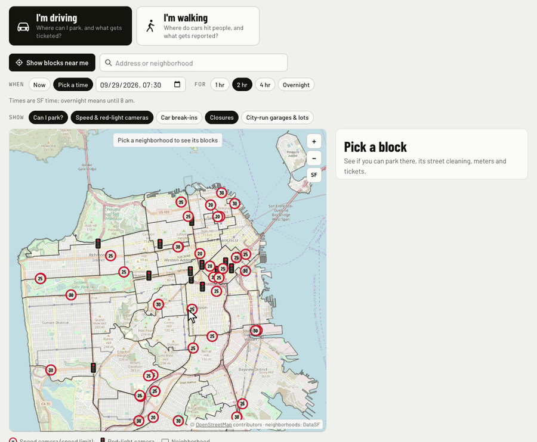
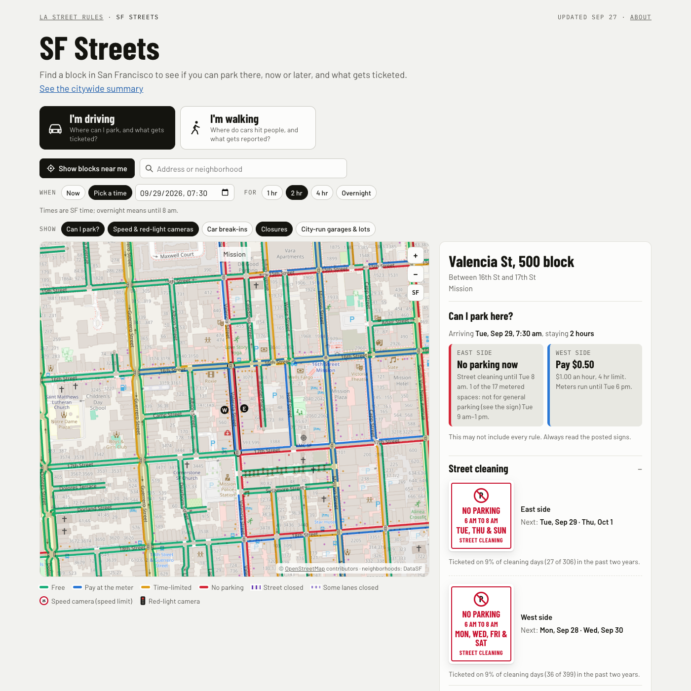
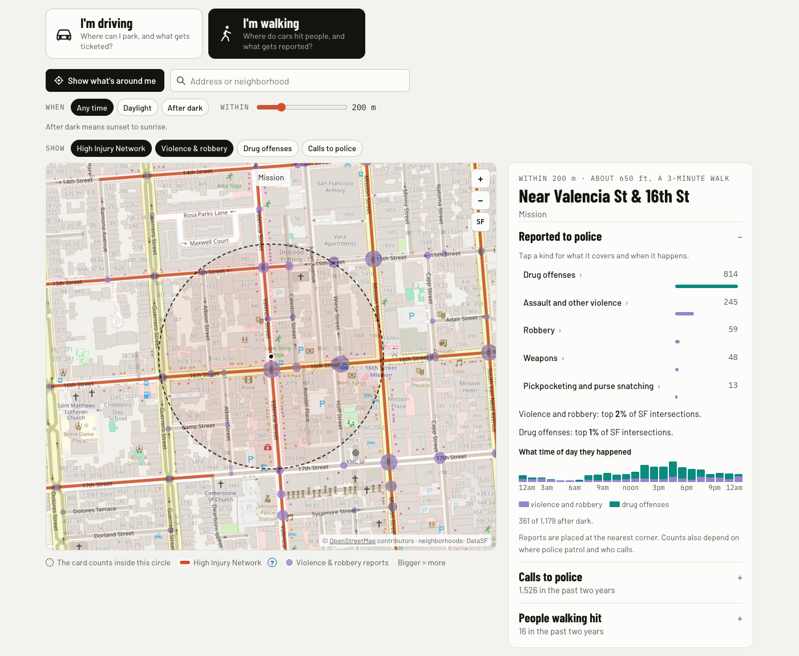
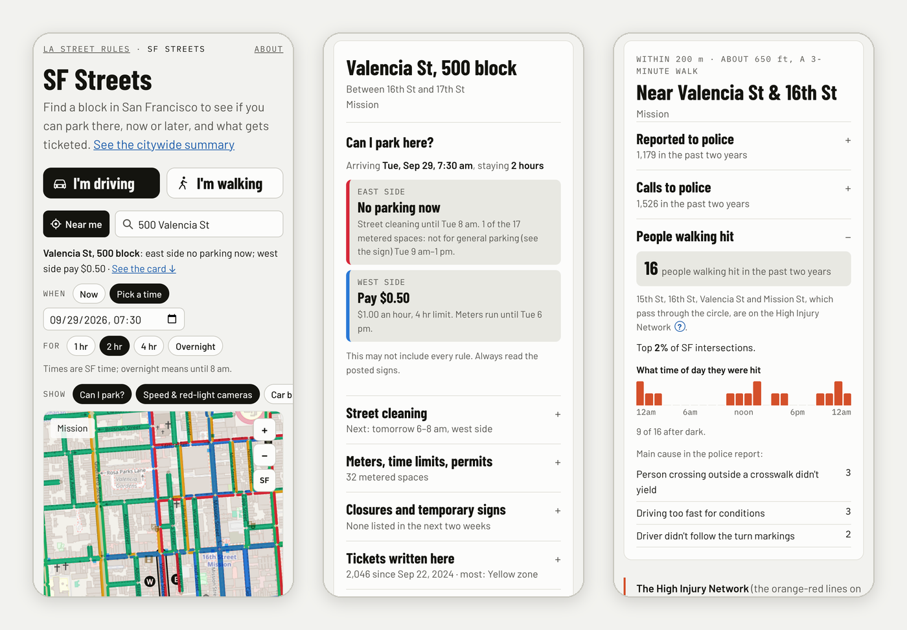
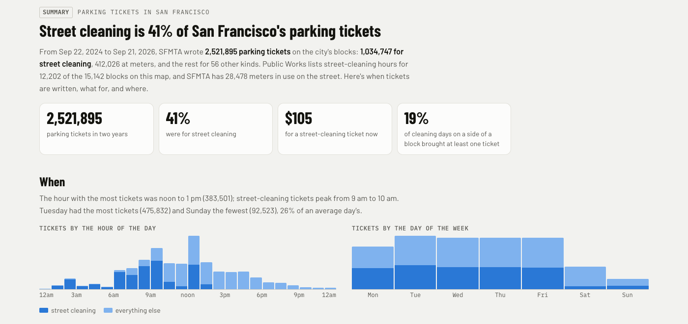
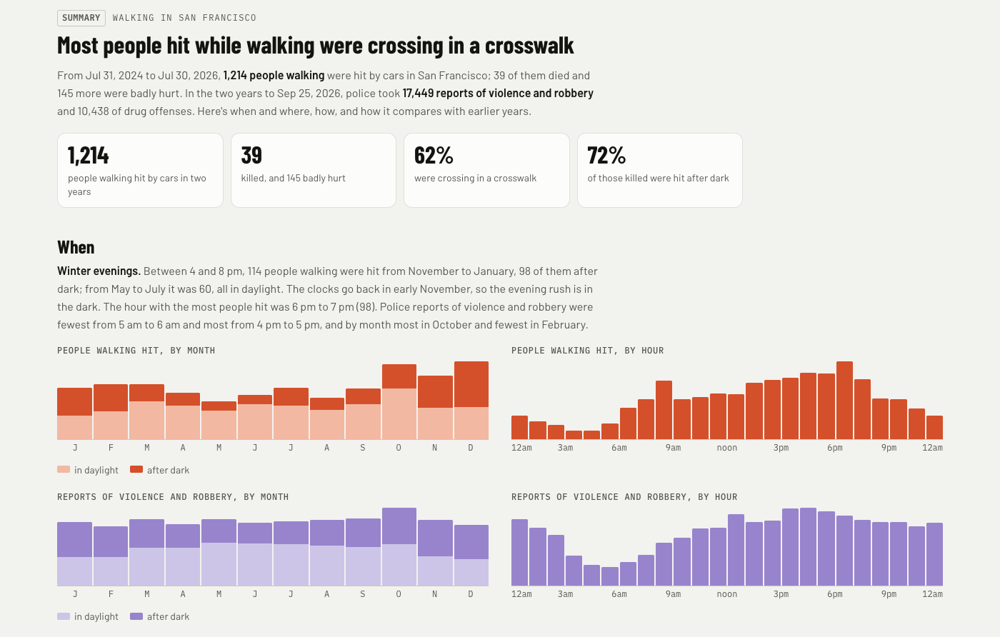

# SF Streets

**[SF Streets](https://citina.github.io/sf-streets/)** is a map of San Francisco that answers a different question
depending on how you're getting around.

- **I'm driving:** can I park on this block, now or at the time I pick, and for how long? What gets ticketed here?
- **I'm walking:** around a spot I pick, how often were people walking hit by cars, and what gets reported to police?

Street cleaning alone is 41% of the 2.5 million parking tickets SFMTA wrote in the last two years, and the rules that
decide whether you can park are spread across half a dozen city lists: sweeping schedules, meters, time limits, permit
areas, tow-away zones, today's closures and temporary signs. SF Streets reads them all for every one of the city's
15,142 blocks and puts the answer on one card. It's the San Francisco sister of
[LA Street Rules](https://citina.github.io/ticket-clock/streets/), built from [DataSF](https://data.sf.gov) and rebuilt
every week.


*Search a block, see if you can park there for the time and stay you pick, open its street-cleaning signs, make the
stay longer and watch the map change, then switch to walking to see what's around the same spot.*

## I'm driving


*Valencia St, 500 block, on a Tuesday at 7:30 am for two hours: the east side is being swept until 8, the west side is
metered. On the map, each side of every block is its own line, colored the same way: free, pay at the meter,
time-limited, or no parking.*

Find a block by searching a street, an address or a neighborhood, by tapping it on the map, or with your location.
The card shows:

- **Can I park here?** For the time and stay you pick, each side of the street: free (and until when), pay (and about
  how much), move by (street cleaning, a tow-away, a time limit or a closure starting during your stay) or no parking
  now, with the rule that decides it. City holidays follow SFMTA's schedule.
- **Street cleaning:** each side's sign as it's posted, the next dates, and how often a cleaning day actually got
  ticketed.
- **Meters, time limits, permits:** metered spaces by cap color, when they're paid and what they cost, time limits,
  residential permit areas, tow-away and no-parking hours.
- **Closures and temporary signs:** street closures and temporary no-parking signs for today and the next two weeks,
  loaded live from data.sf.gov.
- **Tickets written here:** every kind in the last two years, with the fine and the usual day and time; tap one for
  its time-of-day chart.
- City-run garages and lots nearby, car break-ins at the block's corners, and speed and red-light cameras.

## I'm walking


*The 200 m around Valencia St & 16th St, about a 3-minute walk. The orange-red lines are the city's High Injury
Network, the streets where the most people are killed or badly hurt in traffic.*

Pick a spot by tapping the map, searching an address or using your location, then how far around it (100 to 500 m)
and whether it's any time, daylight or after dark. The card counts what's in the circle:

- **Reported to police:** robbery, assault and other violence, pickpocketing, weapons and drug offenses, what time of
  day they happen, and how the circle ranks against the same circle around each of the city's 7,550 intersections.
- **Calls to police:** fights and assaults, someone with a gun or knife, robbery, threats and harassment.
- **People walking hit:** how many were hit by cars, when, the main causes in the police reports, and which streets
  through the circle are on the High Injury Network. It doesn't say how badly people were hurt at a single spot: so
  few people could point to someone.

## On a phone


*The map is on the first screen. After a search the answer shows right above the map, and the card below opens one
row at a time.*

## The whole city

Below the map, each side has a summary of the city as a whole.


*When parking tickets are written, what for, and the blocks with the most street-cleaning tickets.*


*When and where people walking were hit and violence and robbery was reported, around the places visitors go, and
how it compares with earlier years.*

## Not 100% accurate

Everything on the page is built automatically from the city's open data, which can be late or miss temporary changes
like construction or event signs, so always read the posted signs. It isn't a guide to parking illegally or a promise
of safety: past tickets, crashes and police reports don't predict the next one. Police reports and calls depend on
where police patrol and who calls, as much as on where things happen. [DATA_SOURCES.md](DATA_SOURCES.md) lists which dataset is used for what, and which were left out; the
page's "How this was measured" section explains every number.

## How it's built

One hand-written page, [`docs/index.html`](docs/index.html), with no map library and no build step: the map is SVG
over OpenStreetMap tiles, and the block data is split into small map cells that load as you zoom in. Search finds any
street, a house number on it, or a neighborhood. A block can be linked on the driving side (`#drive/13060000`), and a
spot and distance on the walking side (`#walk/@37.76411,-122.42181/250m`); your own location never goes in the link.
See [PLAN.md](PLAN.md) for how the page decides what it shows.

`hoods.py` writes `docs/hoods.json`, the neighborhood outlines. The file is committed, so run it again only if DataSF
updates the layer. The block data in `docs/data/` isn't committed: every Monday `.github/workflows/weekly.yml` runs
`fetch_sf.py` and `analyze_sf.py`, checks the counts against last week's (a drop of more than 10% stops it, and last
week's data stays up), and publishes `docs/data/` as the `sf-data` release. Parking tickets come a month at a time and
are kept between runs in the Actions cache, so a run downloads only the last two months and those whose copy is over
four weeks old (a run without the cache takes about 20 minutes more). Street closures and temporary no-parking signs
aren't in the release: the page loads them from data.sf.gov when it opens. `pages.yml` then deploys `docs/` to GitHub
Pages with that release unpacked into it; it also deploys on every push that changes `docs/`. To rebuild by hand, run
the weekly workflow from the Actions tab (its `force` box publishes past the count check).

## Run it

```
python3 fetch_sf.py      # data.sf.gov -> data/raw/ (about 250 MB; the first run takes about 25 minutes)
python3 analyze_sf.py    # data/raw/ -> docs/data/
python3 -m http.server 8765 --directory docs
```

then open http://localhost:8765/ (add `#walk` for the walking view).

## Who made this

[Citina Liang](https://github.com/citina), a PhD candidate in Industrial & Systems Engineering at USC Viterbi who
models how people behave and how diseases spread, with Claude Code, from first commit to both sides of the map in
three days (25–27 Sep 2026). Its sisters are [LA Street Rules](https://citina.github.io/ticket-clock/streets/)
([ticket-clock](https://github.com/citina/ticket-clock)) and [Curb Log](https://github.com/citina/curb-log).

Map © [OpenStreetMap](https://www.openstreetmap.org/copyright) contributors. Data from [DataSF](https://data.sf.gov).
